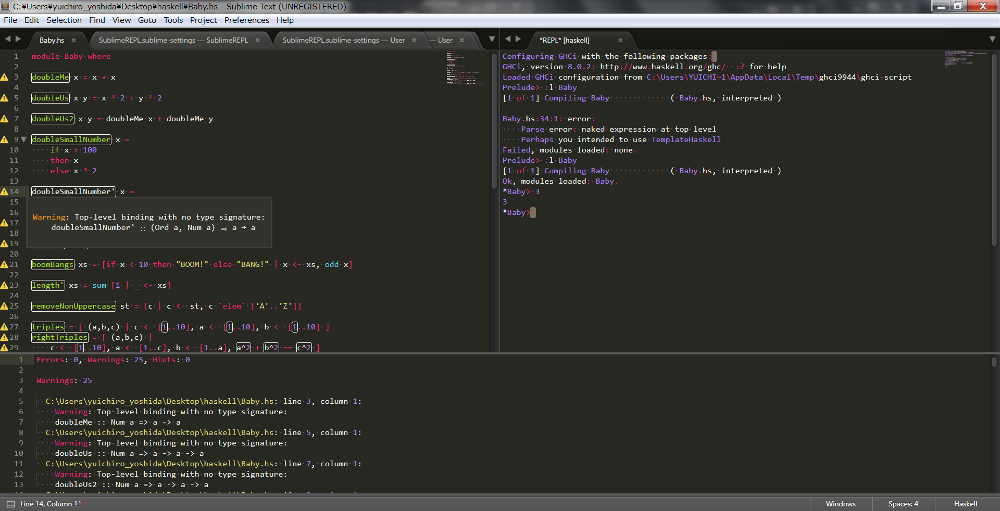

# haskell-tips

仲間内の Haskell もくもく会で共有する tips 置き場です。

主に Wiki、適宜 issue も活用していきましょう！

## リンクとか

### [すごいHaskellたのしく学ぼう！](https://www.amazon.co.jp/dp/B009RO80XY)
もくもく会で、特にやることがなければこれを読むことになっている。Haskell入門では今一番いい本だと思う。通称「すごいH本」。

### [Hackage](https://hackage.haskell.org/)
パッケージリポジトリ。ほぼ全てのパッケージはここにアップロードされる。

### [谷口のGitHubにあるHaskellのリポジトリ](https://github.com/cohei?utf8=✓&tab=repositories&q=&type=source&language=haskell)
参考に。

### [SublimeHaskell](https://github.com/SublimeHaskell/SublimeHaskell)

